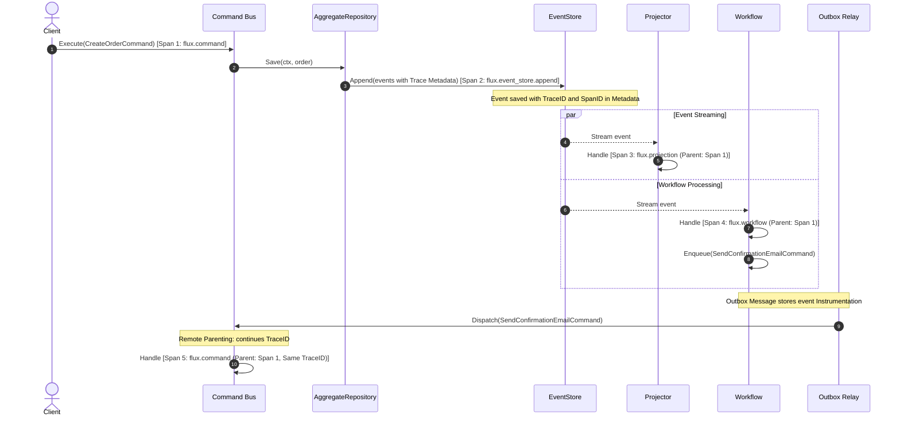

# Flux OpenTelemetry (`fluxotel`)

[](https://pkg.go.dev/github.com/wotek/flux-opentelemetry)
[](https://github.com/wotek/flux-opentelemetry/actions/workflows/build.yml)

OpenTelemetry distributed tracing and metrics integration for the [Flux](https://github.com/wotek/flux) CQRS / Event Sourcing framework.

## Overview

The core `github.com/wotek/flux` framework remains 100% vendor-agnostic and does not depend on OpenTelemetry. Instead, it defines vendor-neutral `Instrumentation` primitives (`TraceID`, `SpanID`, `TraceFlags`) and strongly-typed context reparenting (`WithParent`).

`github.com/wotek/flux-opentelemetry` (`package fluxotel`) is the official translator package. It bridges OpenTelemetry with Flux by providing:

- **Bus Middlewares:** Seamless tracing and metrics for Command and Query buses.
- **Store Decorators:** Transparent client spans and metrics for Event Stores, Snapshot Stores, and Projection Stores.
- **Async Handler Wrappers:** Distributed trace propagation for asynchronous Projectors and Workflows, including full trace continuity across outbox boundaries.
- **Metrics Catalog:** Standardized, low-cardinality semantic metrics for latency, throughput, and errors.

## Installation

```bash
go get github.com/wotek/flux-opentelemetry
```

> [!NOTE]
> Ensure your project uses `github.com/wotek/flux@v1.3.0` or later.

## Wiring Guides

### Command and Query Buses

Wire `CommandMiddleware` and `QueryMiddleware` into your buses:

```go
import (
    "github.com/wotek/flux/command"
    "github.com/wotek/flux/query"
    fluxotel "github.com/wotek/flux-opentelemetry"
    "go.opentelemetry.io/otel"
)

tracer := otel.Tracer("my-service")
meter := otel.Meter("my-service")

// Command Bus
cmdBus := command.NewBus()
cmdBus.Use(fluxotel.CommandMiddleware(tracer, meter))

// Query Bus
queryBus := query.NewBus()
queryBus.Use(fluxotel.QueryMiddleware(tracer, meter))
```

#### Remote Parenting on Commands

When a command is dispatched by an asynchronous Outbox relay, its context contains the parent event's `Instrumentation`. `CommandMiddleware` inspects this instrumentation and links the command execution span to the originating remote span via `trace.ContextWithRemoteSpanContext`, maintaining continuous end-to-end distributed traces.

### Storage Decorators

Wrap your event stores, snapshot stores, and projection stores using the decorators:

```go
import (
    "github.com/wotek/flux"
    eventstore "github.com/wotek/flux/event/store"
    projstore "github.com/wotek/flux/projection/store"
    snapstore "github.com/wotek/flux/snapshot/store"
    fluxotel "github.com/wotek/flux-opentelemetry"
)

// Wrap EventStore (instruments Append, Read, and Stream)
rawEventStore := eventstore.New()
eventStore := fluxotel.WrapEventStore(rawEventStore, tracer, meter)

// Wrap SnapshotStore (instruments Load and Save)
rawSnapshotStore := snapstore.New[MyState]()
snapshotStore := fluxotel.WrapSnapshotStore(rawSnapshotStore, tracer, meter)

// Wrap ProjectionStore (instruments Update and GetPosition)
rawProjStore := projstore.New()
projectionStore := fluxotel.WrapProjectionStore(rawProjStore, tracer, meter)
```

### Asynchronous Projectors

Wrap projection handler functions before registering them with `projection.RegisterHandler`:

```go
import (
    "github.com/wotek/flux/projection"
    fluxotel "github.com/wotek/flux-opentelemetry"
)

projector := projection.New(projectorID, eventStore, projectionStore)

projection.RegisterHandler(projector, fluxotel.WrapProjectionHandler(tracer, meter,
    func(ctx projection.Context, e OrderPlaced) error {
        // Child span "flux.projection" is active in ctx.
        // ctx.WithParent() reparents the Go context while preserving event metadata.
        return projectionStore.Update(ctx, projectorID, env, func(txCtx context.Context) error {
            // Apply read-model mutation
            return nil
        })
    },
))
```

### Workflows and Outbox Dispatches

Wrap workflow transition handlers before registering them with `workflow.RegisterHandler`:

```go
import (
    "github.com/wotek/flux/workflow"
    workflowstore "github.com/wotek/flux/workflow/store"
    fluxotel "github.com/wotek/flux-opentelemetry"
)

wfStore := workflowstore.New[*OrderFulfillmentWorkflow](cmdBus)
orchestrator := workflow.New(orchestratorID, eventStore, nil)

workflow.RegisterHandler(orchestrator, wfStore, fluxotel.WrapWorkflowHandler(tracer, meter,
    func(ctx workflow.Context, wf *OrderFulfillmentWorkflow, e OrderPlaced) error {
        // Child span "flux.workflow" is active in ctx.
        // Queued commands carry the event's trace instrumentation across the outbox boundary.
        workflow.EnqueueCommand(ctx, SendWelcomeEmailCommand{OrderID: e.OrderID})
        return nil
    },
))

// Start orchestrator and outbox relay
go func() { _ = orchestrator.Start(ctx) }()
wfStore.StartRelay(ctx)
```

## End-to-End Distributed Trace Continuity

When a command handler commits changes via `AggregateRepository.Save`, active OpenTelemetry trace metadata is stamped onto the event envelope. Asynchronous consumers continue this trace:



All operations—synchronous command execution, persistence, projection updates, workflow steps, and asynchronous outbox commands—share the same distributed `TraceID`.

## Metrics Catalog

All status attributes are strictly constrained to `"ok"` or `"error"`. High-cardinality values (for example, stream IDs, aggregate IDs, user IDs) are never added to metrics.

| Instrument | Type | Unit | Attributes | Purpose |
| --- | --- | --- | --- | --- |
| `flux.command.duration` | Histogram | `s` | `flux.command.type`, `flux.command.status` | Command handler latency |
| `flux.command.count` | Counter | `1` | `flux.command.type`, `flux.command.status` | Command throughput and error rate |
| `flux.query.duration` | Histogram | `s` | `flux.query.type`, `flux.query.status` | Query handler latency |
| `flux.query.count` | Counter | `1` | `flux.query.type`, `flux.query.status` | Query throughput and errors |
| `flux.event_store.append.duration` | Histogram | `s` | `flux.event_store.status` | Event store append latency |
| `flux.event_store.append.concurrency_conflicts` | Counter | `1` | — | Concurrency conflicts (`flux.ErrConcurrency`) |
| `flux.event_store.append.events` | Counter | `1` | `flux.event_store.status` | Total events appended |
| `flux.event_store.read.duration` | Histogram | `s` | `flux.event_store.operation`, `flux.event_store.status` | Event store read/stream latency |
| `flux.snapshot.load.duration` | Histogram | `s` | `flux.snapshot.status` | Snapshot load latency |
| `flux.snapshot.save.duration` | Histogram | `s` | `flux.snapshot.status` | Snapshot save latency |
| `flux.snapshot.load.misses` | Counter | `1` | — | Cache misses (`flux.ErrSnapshotNotFound`) |
| `flux.projection.store.update.duration` | Histogram | `s` | `flux.projection.status` | Projection store update latency |
| `flux.projection.handler.duration` | Histogram | `s` | `flux.event.name`, `flux.projection.status` | Projection handler latency |
| `flux.projection.handler.count` | Counter | `1` | `flux.event.name`, `flux.projection.status` | Projection handler throughput |
| `flux.workflow.handler.duration` | Histogram | `s` | `flux.event.name`, `flux.workflow.status` | Workflow handler latency |
| `flux.workflow.handler.count` | Counter | `1` | `flux.event.name`, `flux.workflow.status` | Workflow handler throughput |

### Observability Notes

- **Iterator Span Lifecycles:** Event store `Read` and `Stream` wrappers implement two-phase span lifecycles. A short setup span (`flux.event_store.read` / `flux.event_store.stream`) covers the initial query and completes immediately when the iterator handle is returned. An iteration span (`flux.event_store.read.iteration` / `flux.event_store.stream.iteration`) covers consumer ranging, ending when iteration finishes, halts early, or fails. Callers should consume returned iterators.
- **Snapshot Miss Semantics:** A snapshot cache miss (`flux.ErrSnapshotNotFound`) is expected behavior for snapshot repositories and is not treated as a span error. The span status remains `ok`, the span attribute `flux.snapshot.miss=true` is recorded, and the miss is counted via `flux.snapshot.load.misses`. Real persistence errors continue to record span errors and report `error` status.
- **Outbox Metrics:** Future outbox queue metrics (`flux.outbox.dispatch.duration`, `flux.outbox.dispatch.count`, `flux.outbox.depth`) are designated for v1.1. In v1.0, outbox dispatch operations are fully traced as child spans via `CommandMiddleware`.
- **Cardinality Guarantees:** While distributed trace spans may record contextual IDs (such as `flux.stream.id`, `flux.event.id`, and `flux.workflow.id`) to facilitate deep log/trace correlation, metric attributes remain strictly low-cardinality (`type`, `name`, and locked `status` values of `"ok"` or `"error"`).

## License

MIT
